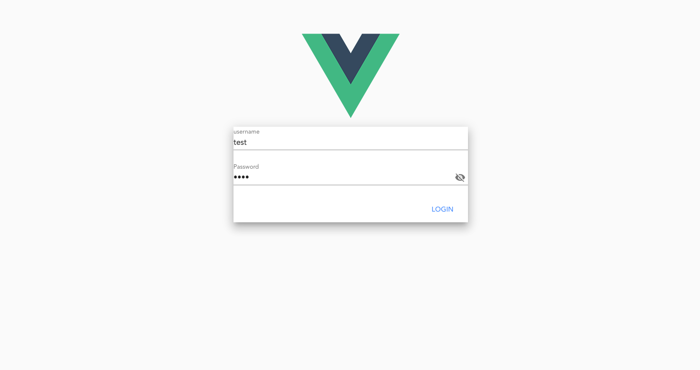
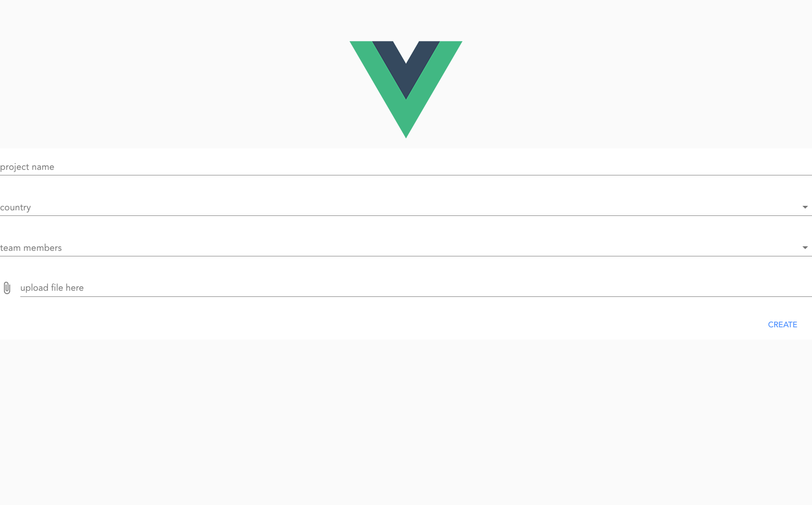

# vueproject 
Login page
- ~~TODO: login page validation~~

Create page
- ~~TODO: create template~~
- ~~TODO: create page validation~~

routing:
 - done:
    - loginpage->success->createpage->success->loginpage
 - pending
    - 404
    - 400

- testing
    [issue with testing](https://stackoverflow.com/questions/52262084/syntax-error-support-for-the-experimental-syntax-decorators-legacy-isnt-cur)
    - login page testing
    - create page testing
    - ~~test with mock api if working~~

#TODO
- use vuex to store cookie

